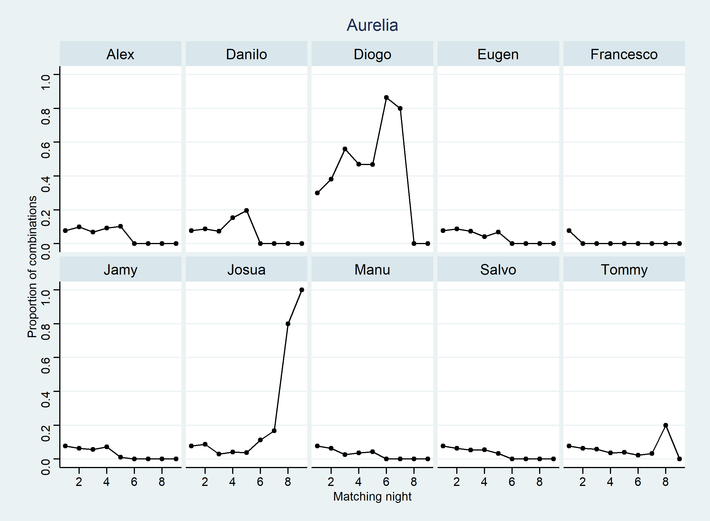

```{r setup, include=FALSE}
knitr::opts_chunk$set(echo = TRUE)
```

```{r, code = readLines("R/main.R"), echo=FALSE, message = FALSE}
```

## What is 'Are You The One?'? 

AYTO is one of my favorite dating shows. This [Wikipedia](https://en.wikipedia.org/wiki/Are_You_the_One%3F_(German_TV_series)) article explains what it is about: 

<blockquote>A group of 10 single women and 10 single men are secretly paired into couples by Experts, via a matchmaking algorithm. Then, while living together, the contestants try to identify all of these "perfect matches". If they succeed, the entire group shares a prize of up to €200,000. Over the course of each season, the contestants go on dates with partners determined by competitions, and have the opportunity to learn in the "truth booth" if a given couple is a correct match. Once the truth booth confirms a perfect match, that couple will go to the honeymoon suite and will automatically be paired up for the remainder of the matching nights. At the end of each episode, the contestants pair up in a "matching night" and learn how many perfect matches they have, but not which matches are correct. The prize was reduced any time that the house failed to identify any matches other than those already confirmed via the truth booth.</blockquote> 

The TV audience usually doesn't find out about all the perfect matches until the final episode, but one can of course write down all the clues from the matching nights and thereby find out that some contestants must surely make a couple, while others can't possibly be one. However, it can be quite difficult to get it all right, because, even with the clues, there are still SO many possible combinations. It's actually a pretty fun puzzle to solve programmatically with R. Isn't it remarkable that therefore this really trashy TV show can be considered educational TV! 

## Let's win the prize money 💰💰
Look at the data table below to get a feeling about the problem. A number x means that this couple sat together in the matching night x, like Alex and Finnja in matching night 2.

```{r, echo = FALSE}
knitr::kable(ayto_tbl, align = "l", format = "simple")
```

We also know the number of lights that came on in night x, and thus the number of perfect matches in night x. Furthermore, we know the results from the truth booths:

```{r, echo = FALSE}
no_match <- no_matches %>% 
  complete(night = 1:9, fill = list(no_matches = "-")) %>%
  group_by(night) %>% 
  summarise(no_match = toString(no_matches)) 
perfect_match <- perfect_matches %>% 
  complete(night = 1:9, fill = list(perfect_matches = "-")) %>%
  group_by(night) %>%
  summarise(perfect_match = toString(perfect_matches))
night_lights %>% pivot_longer(everything(), 
                              names_to = "night", 
                              values_to = "lights", 
                              names_transform = list(night = as.numeric)) %>%
  full_join(no_match, by = "night") %>%
  full_join(perfect_match, by = "night")
```

In the beginning, we have 10! = 3,628,800 possible combinations. Later in the season, there usually joins an 11th female candidate (here it is Vanessa), so that one male candidate gets a second match. There are therefore 36,288,000 combinations. By combining the clues episode by episode, the algorithm is able to eliminate all the impossible combinations until only one combination remains: 

```{r, echo = FALSE}
get_n_combs_development(summarized_table)
```

```{r, echo = FALSE}
combs_dfs_list[[8]] %>% 
  pivot_longer(everything(), names_to = "girl", values_to = "boy")
```

We can also plot the development of proportion of combinations for specific couples: 

```{r, echo = FALSE}

```


