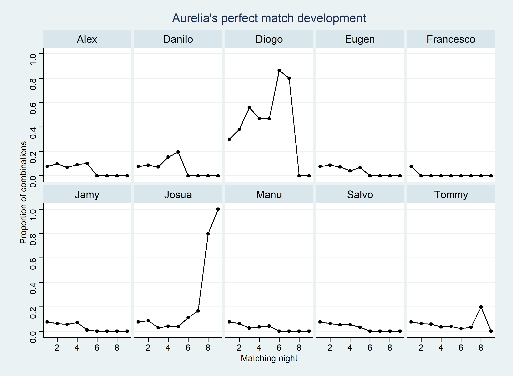

Solving the ‘Are You The One?’ puzzle
================

## What is ‘Are You The One?’?

AYTO is one of my favorite dating shows. This
[Wikipedia](https://en.wikipedia.org/wiki/Are_You_the_One%3F_(German_TV_series))
article explains what it is about:

<blockquote>
A group of 10 single women and 10 single men are secretly paired into
couples by Experts, via a matchmaking algorithm. Then, while living
together, the contestants try to identify all of these “perfect
matches”. If they succeed, the entire group shares a prize of up to
€200,000. Over the course of each season, the contestants go on dates
with partners determined by competitions, and have the opportunity to
learn in the “truth booth” if a given couple is a correct match. Once
the truth booth confirms a perfect match, that couple will go to the
honeymoon suite and will automatically be paired up for the remainder of
the matching nights. At the end of each episode, the contestants pair up
in a “matching night” and learn how many perfect matches they have, but
not which matches are correct. The prize was reduced any time that the
house failed to identify any matches other than those already confirmed
via the truth booth.
</blockquote>

The TV audience usually doesn’t find out about all the perfect matches
until the final episode, but one can of course write down all the clues
from the matching nights and thereby find out that some contestants must
surely make a couple, while others can’t possibly be one. However, it
can be quite difficult to get it all right, because, even with the
clues, there are still SO many possible combinations. It’s actually a
pretty fun puzzle to solve programmatically with R. Isn’t it remarkable
that therefore this really trashy TV show can be considered educational
TV!

## Let’s win the prize money 💰💰

Look at the data table below to get a feeling about the problem. A
number x means that this couple sat together in the matching night x,
like Alex and Finnja in matching night 2.

|           | Aurelia       | Finnja  | Jacky      | Jill | Kathleen            | Melina        | Sarah   | Steffi  | Jules                  | Walentina  | Vanessa |
|-----------|:--------------|:--------|:-----------|:-----|:--------------------|:--------------|:--------|:--------|:-----------------------|:-----------|:--------|
| Alex      | 0             | 2       | 6          | 0    | 0                   | 7             | 4, 8    | 3, 5    | 1                      | 0          | 9       |
| Danilo    | 4, 6, 7       | 0       | 0          | 5, 8 | 0                   | 3             | 2, 9    | 1       | 0                      | 0          | 0       |
| Diogo     | 1, 2, 3, 5, 8 | 0       | 0          | 9    | 0                   | 0             | 0       | 0       | 0                      | 0          | 4, 6, 7 |
| Eugen     | 0             | 3, 4, 5 | 7          | 6    | 0                   | 8             | 0       | 2       | 0                      | 1, 9       | 0       |
| Jamy      | 0             | 6       | 0          | 1, 2 | 0                   | 0             | 5, 7    | 4, 8, 9 | 0                      | 0          | 3       |
| Josua     | 9             | 0       | 0          | 0    | 0                   | 0             | 1, 3, 6 | 0       | 0                      | 2, 4, 5, 7 | 8       |
| Manu      | 0             | 7       | 0          | 4    | 1, 2, 3, 5, 6, 8, 9 | 0             | 0       | 0       | 0                      | 0          | 0       |
| Salvo     | 0             | 0       | 1, 2, 5, 9 | 7    | 4                   | 0             | 0       | 0       | 0                      | 3, 6, 8    | 0       |
| Francesco | 0             | 1       | 0          | 0    | 0                   | 0             | 0       | 0       | 2, 3 ,4, 5, 6, 7, 8, 9 | 0          | 0       |
| Tommy     | 0             | 8, 9    | 0          | 3    | 0                   | 1, 2, 4, 5, 6 | 0       | 7       | 0                      | 0          | 0       |

We also know the number of lights that came on in night x, and thus the
number of perfect matches in night x. Furthermore, we know the results
from the truth booths:

    ## # A tibble: 9 × 4
    ##   night lights no_match                  perfect_match  
    ##   <dbl>  <dbl> <chr>                     <chr>          
    ## 1     1      3 Finnja+Danilo             -              
    ## 2     2      3 Walentina+Tommy           Jules+Francesco
    ## 3     3      4 -                         -              
    ## 4     4      3 -                         -              
    ## 5     5      3 Finnja+Salvo              -              
    ## 6     6      2 Finnja+Eugen              -              
    ## 7     7      1 Steffi+Eugen              -              
    ## 8     8      4 Melina+Tommy, Sarah+Josua -              
    ## 9     9      7 -                         Aurelia+Josua

In the beginning, we have 10! = 3,628,800 possible combinations. Later
in the season, there usually joins an 11th female candidate (here it is
Vanessa), so that one male candidate gets a second match. There are
therefore 36,288,000 combinations. By combining the clues episode by
episode, the algorithm is able to eliminate all the impossible
combinations until only one combination remains:

    ## # A tibble: 10 × 2
    ##    night  n_combs
    ##    <dbl>    <dbl>
    ##  1     0 36288000
    ##  2     1  2224800
    ##  3     2    70200
    ##  4     3    10867
    ##  5     4     2000
    ##  6     5      783
    ##  7     6       88
    ##  8     7       60
    ##  9     8       10
    ## 10     9        1

    ## # A tibble: 11 × 2
    ##    girl      boy      
    ##    <chr>     <chr>    
    ##  1 Aurelia   Josua    
    ##  2 Finnja    Diogo    
    ##  3 Jacky     Salvo    
    ##  4 Jill      Tommy    
    ##  5 Jules     Francesco
    ##  6 Kathleen  Manu     
    ##  7 Melina    Danilo   
    ##  8 Sarah     Alex     
    ##  9 Steffi    Jamy     
    ## 10 Vanessa   Alex     
    ## 11 Walentina Eugen

We can also plot the development of proportion of combinations for
specific couples:

<!-- -->
