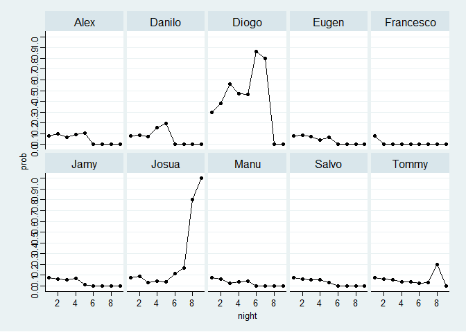
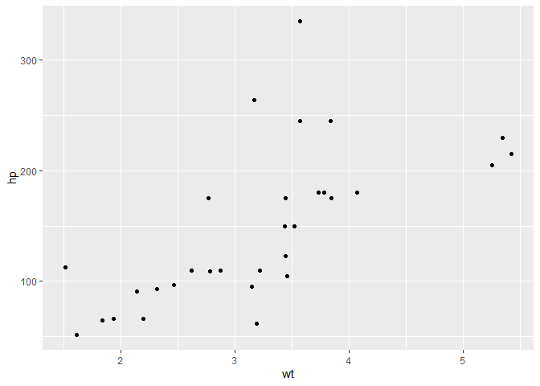

# What is ‘Are You The One’?

AYTO is one of my favorite dating shows. This
[Wikipedia](https://en.wikipedia.org/wiki/Are_You_the_One%3F_(German_TV_series))
article explains what it is about:

<blockquote>
A group of 10 single women and 10 single men are secretly paired into
couples by Experts, via a matchmaking algorithm. Then, while living
together, the contestants try to identify all of these “perfect
matches”. If they succeed, the entire group shares a prize of up to
€200,000. Over the course of each season, the contestants go on dates
with partners determined by competitions, and have the opportunity to
learn in the “truth booth” if a given couple is a correct match. Once
the truth booth confirms a perfect match, that couple will go to the
honeymoon suite and will automatically be paired up for the remainder of
the matching nights. At the end of each episode, the contestants pair up
in a “matching night” and learn how many perfect matches they have, but
not which matches are correct. The prize was reduced any time that the
house failed to identify any matches other than those already confirmed
via the truth booth.
</blockquote>

The TV audience usually doesn’t find out about all the Perfect Matches
until the final episode, but one can of course write down all the clues
from the Matching Nights and thereby find out that some contestants must
surely make a couple, while others can’t possibly be one. However, it
can be quite difficult to get it all right, because, even with the
clues, there are still SO many possible combinations. In the following
report I show how I used the R package `dplyr` to solve the puzzle and
symbolically win the prize money 💰💰

But before diving into the code, first look at the data table below to
get a feeling about the problem:

|           | Aurelia       | Finnja  | Jacky      | Jill | Kathleen            | Melina        | Sarah   | Steffi  | Jules                  | Walentina  | Vanessa |
|-----------|:--------------|:--------|:-----------|:-----|:--------------------|:--------------|:--------|:--------|:-----------------------|:-----------|:--------|
| Alex      | 0             | 2       | 6          | 0    | 0                   | 7             | 4, 8    | 3, 5    | 1                      | 0          | 9       |
| Danilo    | 4, 6, 7       | 0       | 0          | 5, 8 | 0                   | 3             | 2, 9    | 1       | 0                      | 0          | 0       |
| Diogo     | 1, 2, 3, 5, 8 | 0       | 0          | 9    | 0                   | 0             | 0       | 0       | 0                      | 0          | 4, 6, 7 |
| Eugen     | 0             | 3, 4, 5 | 7          | 6    | 0                   | 8             | 0       | 2       | 0                      | 1, 9       | 0       |
| Jamy      | 0             | 6       | 0          | 1, 2 | 0                   | 0             | 5, 7    | 4, 8, 9 | 0                      | 0          | 3       |
| Josua     | 9             | 0       | 0          | 0    | 0                   | 0             | 1, 3, 6 | 0       | 0                      | 2, 4, 5, 7 | 8       |
| Manu      | 0             | 7       | 0          | 4    | 1, 2, 3, 5, 6, 8, 9 | 0             | 0       | 0       | 0                      | 0          | 0       |
| Salvo     | 0             | 0       | 1, 2, 5, 9 | 7    | 4                   | 0             | 0       | 0       | 0                      | 3, 6, 8    | 0       |
| Francesco | 0             | 1       | 0          | 0    | 0                   | 0             | 0       | 0       | 2, 3 ,4, 5, 6, 7, 8, 9 | 0          | 0       |
| Tommy     | 0             | 8, 9    | 0          | 3    | 0                   | 1, 2, 4, 5, 6 | 0       | 7       | 0                      | 0          | 0       |

## 2. Run Code 🏃

You can embed R code chunks in your notebook like this. You can run this
code by clicking ( ▶ \| Run ) or pressing `Ctrl`+`Shift`+`Enter` when
your cursor is in the code chunk.

## 3. Publish Work 🍻

When you are ready to share your analysis, you can click the **Publish**
button to build a publication that includes the rendered markdown text,
the R code and the outputs of the R code chunks.

## 4. Explore more!
